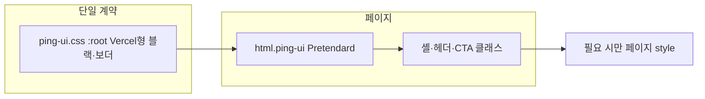

# PING 페이지별 UI 적용 가이드

> **인앱 체크리스트:** 개발 중에는 [`/ui-rules`](http://localhost:3002/ui-rules)에서 토큰·규칙·페이지별 적용 상태를 확인하세요.

핑(PING)의 정체성을 **세련되고 전문적인 IT SaaS 빌더(Vercel 스타일)**로 규정한다. 부고장이라는 무거운 주제를 담백하게 담되, 플랫폼의 기술적 신뢰도와 모던함을 살리기 위해 **블랙과 화이트의 강한 대비**와 **정교한 선(Border)** 기반 디자인 시스템을 따른다.

제품 HTML이 **어떤 UI 계약을 따르는지** 파일 단위로 정리한 표이다. 색·간격·보더를 바꿀 때는 여기서 해당 페이지를 찾은 뒤, 원칙대로 **[assets/css/ping-ui.css](../assets/css/ping-ui.css)를 먼저** 본다.

---

## 1. 공통 규칙 (모든 제품 페이지)

| 기준 | 역할 |
|------|------|
| [docs/CODING-STANDARD.md](./CODING-STANDARD.md) | 공식 웹/Node/Express/보안 문서 기준의 **코드 검수·백엔드· XSS 주의사항**. |
| [assets/css/ping-ui.css](../assets/css/ping-ui.css) 상단 **DESIGN CONTRACT** | `:root` 토큰만으로 색·라운드·그림자·보더를 맞춤. HTML `<style>` 안에 동일 목적의 `:root`를 새로 두지 않는 것이 원칙. |
| [.cursor/rules/ping-ui-design-system.mdc](../.cursor/rules/ping-ui-design-system.mdc) | 수정 절차(CSS 우선 → HTML은 클래스·`var(--*)`). |
| 폰트 | `html.ping-ui`에서 Pretendard 계열(`--font-ping-ui`). 군더더기 없는 Vercel형 모던 고딕. 일부 페이지가 Google Fonts로 추가 로드함. |

**`<html>` 클래스 패턴**

| 클래스 | 용도 |
|--------|------|
| `ping-ui` | 필수. 제품 UI 기본 셸·타이포. |
| `ping-one-screen` | 뷰포트 한 화면 레이아웃(대량 발송 메인). |
| `ping-dashboard-dark` | 어두운 대시보드 배경(일부 관리 화면). |
| `ping-surface-dark` | 히어로/풀블록 등 배경을 페이지가 직접 지정할 때(`ping-ui.css`에서 body 배경 투명 처리). |
| `ob-flow-page` | 부고 플로 일부 화면(흐름용 마커). |

**Tailwind CDN**

| 구분 | 설명 |
|------|------|
| 사용함 | 아래 표에서 **Tailwind = 예**인 파일만 `cdn.tailwindcss.com` 사용. |
| 사용 안 함 | 그 외 제품 페이지는 유틸리티 없이 `ping-ui.css` + 필요 시 페이지 `<style>`. |
| 원칙 | 정적 HTML **신규**는 Tailwind 없이 `ping-ui` 계약만 쓰는 것을 권장. **`src/app`(Next)** 는 Tailwind 유틸 + 동일 토큰(`tailwind.config.ts`)으로 통일. [index.html](../index.html)·일부 관리/부고 화면은 **레거시 병행**. |

**페이지 전용 `<style>` 표기**

| 표기 | 의미 |
|------|------|
| 없음 | 인라인 `<style>` 없음 또는 무시할 수준. |
| 있음 | 한 블록·페이지 전용 스타일. |
| 대량(레거시) | **index.html** 수준의 대형 인라인 블록. |
| 있음(로컬 `:root`) | DESIGN CONTRACT와 겹치는 로컬 토큰 블록이 있음. 점진적으로 `ping-ui.css`로 이전 권장. |

**이 가이드에서 제외한 경로**

- `node_modules/**`, `app/node_modules/**`, `functions/node_modules/**` 등 의존성·리포트 HTML  
- `spline-next/.next/**` 등 빌드 산출물  

---

## 2. 핵심 디자인 시스템 (Vercel 스타일 미니멀리즘)

PING은 **하이콘트라스트 블랙·화이트** 기반 미니멀리즘을 지향한다. 과한 색 사용은 줄이고, **회색 보더와 여백**으로 위계를 만든다. 아래 Hex는 `ping-ui.css`의 `:root` 변수로 선언해 전역을 맞춘다.

### 2.1 PING 컬러 팔레트 (Vercel Theme)

| 구분 | 컬러 톤 | Hex | 적용 |
|------|---------|-----|------|
| 포인트 | 솔리드 블랙 | `#000000` | Primary CTA 배경, 핵심 액션·강조 아이콘. |
| 배경/App | 앱 베이스 | `#FAFAFA` | 페이지·캔버스 배경. |
| | 서피스 | `#FFFFFF` | 카드·폼 등 콘텐츠 영역. |
| 라인 | 라이트 보더 | `#EAEAEA` | 카드·입력·섹션 구분선. |
| 텍스트 | 메인 | `#111111` | 타이틀·고·상주 등 최상위 가독성. |
| | 본문 | `#666666` | 일반 본문. |
| | 캡션 | `#888888` | 보조 설명·플레이스홀더·비활성. |

### 2.2 컴포넌트 디자인 가이드

- **형태:** 과한 라운드보다 **6px~8px** 수준의 단정한 코너로 소프트웨어 톤을 유지한다.
- **보더 중심:** 그림자에 의존하기보다 **`#EAEAEA`** 계열의 얇은 선으로 구역을 나눈다.
- **흑백 절제:** 장식·다채로운 색은 최소화하고, **`#000000`** CTA로 신뢰감과 절제된 예의를 함께 표현한다.
- **버튼 위계 (Vercel식):** **Primary**는 **`#000000` 배경 + 흰색 라벨** (`--ping-surface` / `#FFFFFF`). **Secondary**는 밝은 서피스 + **`#EAEAEA` 보더** + 본문색 텍스트(예: `index.html` 하단 **이전**). 호버 시 Primary는 테두리·명도만 살짝 조정해도 되고, 라벨은 흰색을 유지한다.

---

## 3. 스타일 적용 흐름 (참고)

---

## 4. 섹션별 페이지 표

열: **파일** | **html 클래스** | **ping-ui.css** | **Tailwind** | **페이지 `<style>`** | **비고**

`ping-ui.css` 경로는 그 HTML 파일 기준 상대 경로.

### 4.1 대량 발송·결제 코어

| 파일 | html 클래스 | ping-ui.css | Tailwind | 페이지 `<style>` | 비고 |
|------|-------------|-------------|----------|-------------------|------|
| [index.html](../index.html) | `ping-ui ping-one-screen` | `assets/css/ping-ui.css` | 예 | 대량(레거시) | 햄버거 사이드 메뉴, `index-page-shell`, `index-bulk-compose`, `input-field`, 하단 CTA. `SEND-FLOW-SCREENS` 주석·[ping-send-real-pages.mdc](../.cursor/rules/ping-send-real-pages.mdc) 참고. |
| [checkout.html](../checkout.html) | `ping-ui` | `assets/css/ping-ui.css` | 예 | 있음 | 결제 위젯 UI. 보더·라인 기준 정리. |
| [payment-success.html](../payment-success.html) | `ping-ui` | `assets/css/ping-ui.css` | 아니오 | 있음 | `pay-ok-*` 전용 스타일. 명단 받기 버튼 등. |

### 4.2 부고 작성·게스트 (`obituary/`)

| 파일 | html 클래스 | ping-ui.css | Tailwind | 페이지 `<style>` | 비고 |
|------|-------------|-------------|----------|-------------------|------|
| [obituary/obituary-create.html](../obituary/obituary-create.html) | `ping-ui` | `../assets/css/ping-ui.css` | 예 | 있음 | |
| [obituary/obituary-entry.html](../obituary/obituary-entry.html) | `ping-ui` | `../assets/css/ping-ui.css` | 아니오 | 없음 | 부고 시작(시작하기). 배포 URL `/login`. ping-ui + 클래스만. |
| [obituary/obituary-form.html](../obituary/obituary-form.html) | `ping-ui` | `../assets/css/ping-ui.css` | 예 | 있음 | |
| [obituary/obituary-guest-verify.html](../obituary/obituary-guest-verify.html) | `ping-ui` | `../assets/css/ping-ui.css` | 아니오 | 있음 | `ping-shell`·`ping-top-nav--blend`·`ping-label`/`ping-input`/`ping-btn-primary`. OTP·프로그레스 바만 페이지 `<style>`. |
| [obituary/obituary-member-login.html](../obituary/obituary-member-login.html) | `ping-ui` | `../assets/css/ping-ui.css` | 아니오 | 없음 | |
| [obituary/obituary-mortuary.html](../obituary/obituary-mortuary.html) | `ping-ui ob-flow-page` | `../assets/css/ping-ui.css` | 예 | 없음 | |
| [obituary/obituary-public.html](../obituary/obituary-public.html) | `ping-ui ob-flow-page` | `../assets/css/ping-ui.css` | 예 | 없음 | 공개 부고. |
| [obituary/obituary-review.html](../obituary/obituary-review.html) | `ping-ui ping-surface-dark` | `../assets/css/ping-ui.css` | 예 | 있음 | 다크 서피스. |
| [obituary/obituary-sales.html](../obituary/obituary-sales.html) | `ping-ui ob-flow-page` | `../assets/css/ping-ui.css` | 예 | 없음 | |
| [obituary/obituary-send.html](../obituary/obituary-send.html) | `ping-ui ob-flow-page` | `../assets/css/ping-ui.css` | 예 | 없음 | |
| [obituary/obituary-signup-register.html](../obituary/obituary-signup-register.html) | `ping-ui` | `../assets/css/ping-ui.css` | 아니오 | 없음 | |
| [obituary/obituary-signup-terms.html](../obituary/obituary-signup-terms.html) | `ping-ui` | `../assets/css/ping-ui.css` | 아니오 | 없음 | |
| [obituary/obituary-verify-email.html](../obituary/obituary-verify-email.html) | `ping-ui` | `../assets/css/ping-ui.css` | 아니오 | 없음 | |
| [obituary/mourner-info.html](../obituary/mourner-info.html) | `ping-ui` | `../assets/css/ping-ui.css` | 예 | 있음 | |

### 4.3 고객·마케팅·정보

| 파일 | html 클래스 | ping-ui.css | Tailwind | 페이지 `<style>` | 비고 |
|------|-------------|-------------|----------|-------------------|------|
| [overview.html](../overview.html) | `ping-ui` | `assets/css/ping-ui.css` | 아니오 | 있음(로컬 `:root`) | 랜딩. 로컬 `:root`는 점진적으로 `ping-ui.css`로 이전 권장. |
| [intro.html](../intro.html) | `ping-ui` | `assets/css/ping-ui.css` | 아니오 | 있음 | 인트로 풀블랙 배경 등(DESIGN CONTRACT 예외 성격). |
| [customer-center.html](../customer-center.html) | `ping-ui` | `assets/css/ping-ui.css` | 아니오 | 있음 | |
| [mypage.html](../mypage.html) | `ping-ui` | `assets/css/ping-ui.css` | 아니오 | 없음 | `mypage-shell`, `ping-back-btn` 등. |
| [partnership.html](../partnership.html) | `ping-ui` | `assets/css/ping-ui.css` | 아니오 | 있음 | |
| [tech-blog.html](../tech-blog.html) | `ping-ui` | `assets/css/ping-ui.css` | 아니오 | 있음 | |
| [inquiry-board.html](../inquiry-board.html) | `ping-ui` | `assets/css/ping-ui.css` | 아니오 | 있음 | |

### 4.4 추모(메모리얼)

| 파일 | html 클래스 | ping-ui.css | Tailwind | 페이지 `<style>` | 비고 |
|------|-------------|-------------|----------|-------------------|------|
| [memorial-list.html](../memorial-list.html) | `ping-ui` | `assets/css/ping-ui.css` | 아니오 | 있음(로컬 `:root`) | |
| [memorial-hall.html](../memorial-hall.html) | `ping-ui` | `assets/css/ping-ui.css` | 아니오 | 있음 | |
| [memorial-auth.html](../memorial-auth.html) | `ping-ui` | `assets/css/ping-ui.css` | 아니오 | 있음 | |

### 4.5 약관·정책 (`legal/`)

| 파일 | html 클래스 | ping-ui.css | Tailwind | 페이지 `<style>` | 비고 |
|------|-------------|-------------|----------|-------------------|------|
| [legal/terms-of-service.html](../legal/terms-of-service.html) | `ping-ui` | `../assets/css/ping-ui.css` | 아니오 | 있음 | |
| [legal/privacy-policy.html](../legal/privacy-policy.html) | `ping-ui` | `../assets/css/ping-ui.css` | 아니오 | 있음 | |
| [legal/refund-policy.html](../legal/refund-policy.html) | `ping-ui` | `../assets/css/ping-ui.css` | 아니오 | 있음 | |
| [legal/service-payment-guide.html](../legal/service-payment-guide.html) | `ping-ui` | `../assets/css/ping-ui.css` | 아니오 | 있음 | |
| [legal/copyright.html](../legal/copyright.html) | `ping-ui` | `../assets/css/ping-ui.css` | 아니오 | 있음 | |

### 4.6 관리자 (`admin/`)

| 파일 | html 클래스 | ping-ui.css | Tailwind | 페이지 `<style>` | 비고 |
|------|-------------|-------------|----------|-------------------|------|
| [admin/admin-auth.html](../admin/admin-auth.html) | `ping-ui` | `../assets/css/ping-ui.css` | 예 | 있음 | |
| [admin/admin-dashboard.html](../admin/admin-dashboard.html) | `ping-ui` | `../assets/css/ping-ui.css` | 예 | 있음 | |
| [admin/partner-dashboard.html](../admin/partner-dashboard.html) | `ping-ui` | `../assets/css/ping-ui.css` | 예 | 있음 | |
| [admin/service-status.html](../admin/service-status.html) | `ping-ui ping-dashboard-dark` | `../assets/css/ping-ui.css` | 예 | 있음 | |
| [admin/unified-monitoring.html](../admin/unified-monitoring.html) | `ping-ui ping-dashboard-dark` | `../assets/css/ping-ui.css` | 예 | 있음 | |

### 4.7 데모·실험·기타 (제품 외·예외 허용)

| 파일 | html 클래스 | ping-ui.css | Tailwind | 페이지 `<style>` | 비고 |
|------|-------------|-------------|----------|-------------------|------|
| [ping-cx-flow.html](../ping-cx-flow.html) | `ping-ui` | `assets/css/ping-ui.css` | 아니오 | 있음 | CX 플로 데모. |
| [ping-cx-flow ex.html](../ping-cx-flow%20ex.html) | `ping-ui` | `assets/css/ping-ui.css` | 아니오 | 있음 | 변형 데모. |
| [stitch-wave.html](../stitch-wave.html) | `ping-ui ping-surface-dark` | `assets/css/ping-ui.css` | 아니오 | 있음 | 실험용 비주얼. |
| [setup-finish.html](../setup-finish.html) | *(없음)* | *(없음)* | 아니오 | 없음 | **비제품**: frameset만 있는 레거시. UI 가이드·계약 대상 아님. |

---

## 5. 유지보수 시 체크리스트

1. 새 `.html` 추가 시 이 문서에 **같은 형식의 행**을 추가한다.
2. **솔리드 블랙 포인트·보더 시스템**(위 §2.1 팔레트 → `ping-ui.css` `:root`·공용 클래스)만 수정하고, HTML에 임의 헥스 블록을 새로 쌓지 않는다.
3. 컴포넌트 추가 시 과한 라운드·짙은 그림자보다 **보더·단색 면**으로 소프트웨어 톤이 깨지지 않는지 본다.
4. [index.html](../index.html)처럼 **Tailwind + 대량 인라인** 화면은 가능하면 ping-ui 토큰(`var(--ping-primary)` 등)으로 치환해 §2와 맞춘다.
5. `index.html` 내부만의 논리 화면은 [ping-send-real-pages.mdc](../.cursor/rules/ping-send-real-pages.mdc)와 탭 제목(`indexSyncFlowDocumentTitle`)을 함께 본다.

---

## 6. 페이지 템플릿 고정 UI (조립 체크리스트)

아래 순서대로 맞추면 `obituary-member-login.html`, `obituary-verify-email.html`, `obituary-guest-verify.html` 등과 동일한 **ping 셸**이 된다. 색·간격의 근거는 항상 **[assets/css/ping-ui.css](../assets/css/ping-ui.css)** 상단 **DESIGN CONTRACT**와 `:root` 토큰이다.

### 6.1 셸·헤더·뒤로 가기

| 단계 | 할 일 |
|------|--------|
| 루트 | `<html lang="ko" class="ping-ui">` |
| 폰트 | Pretendard 한 줄(구글 폰트 링크) — 다른 페이지와 동일 패턴 |
| CSS | `ping-ui.css` 링크 (HTML 위치 기준 상대 경로) |
| 바디 | `body.ping-layout-centered` |
| 컨테이너 | `.ping-shell` (로그인·부고 시작류는 `.ping-shell.ob-entry-shell` 함께 쓰는 경우가 많음) |
| 헤더 | `header.ping-top-nav` + 제목 `h1.ping-top-nav__title` |
| 뒤로 | `a.ping-top-nav__back.ping-back-btn` + 안쪽 `span.ping-chevron-left` (`aria-label="뒤로"`) |
| 블렌드 | 상단이 다른 부고 항목과 이어질 때 `ping-top-nav--blend` ([ping-ui.css](../assets/css/ping-ui.css) `.ob-entry-shell` 근처) |
| 스크롤 라인 | 필요 시 `ping-nav-scroll-underline.js` defer — `.ping-top-nav`에 스크롤 시 `.ping-sticky-nav--scrolled` 적용 |
| 뒤로 없음·가운데만 | `ping-top-nav--balanced` + 양쪽 `.ping-top-nav__spacer` — 참고: `obituary-verify-email.html` |

### 6.2 본문·타이포·간격

| 용도 | 클래스 | 정의 위치 |
|------|--------|-----------|
| 메인 영역 | `main.ping-main` (+ 필요 시 `ping-main--tight-top`) | `ping-ui.css` `.ping-main` |
| 리드 문단 | `.ping-lead` | 동일 |
| 하단 보조 문구 | `.ping-foot` | 동일 |
| 세로 스택(폼 필드) | `.ping-stack` / `.ping-stack--relaxed` | 동일 |

글자 크기·굵기는 **임의 `text-[13px]`류 유틸 대신** 위 클래스와 `ping-ui.css`를 쓴다. (레거시로 Tailwind를 쓰는 파일은 §4 표 참고.)

### 6.3 색·토큰 (파일 지점)

- **전역 토큰만:** `ping-ui.css`의 `:root` (`--ping-primary`, `--ping-bg`, `--ping-field-fill`, `--ping-ui-text`, `--ping-ui-text-sub`, `--ping-ui-text-hint` 등).
- 제품 HTML의 `<style>` 안에 **동일 목적의 `:root { … }`를 새로 두지 않는다** ([ping-ui-design-system.mdc](../.cursor/rules/ping-ui-design-system.mdc)). 페이지 전용은 레이아웃·애니메이션·한정 컴포넌트만.

### 6.4 폼·버튼

| 요소 | 클래스 |
|------|--------|
| 라벨 | `.ping-label` / `.ping-label-hint` |
| 입력 | `.ping-input` |
| 주요 CTA | `.ping-btn-primary` |
| 보조 CTA | `.ping-btn-secondary` |
| 부고 플로 슬레이트 단일 CTA(예외) | `.ping-flow-cta-slate` — `ping-ui.css` 주석에 적힌 용도로만 |
| 인라인 에러 | `.ping-alert--error` |
| 숨김 | `.ping-hidden` |

### 6.5 신규 페이지 추가 시

§4 표에 한 행 추가하고, §1 원칙(Tailwind 신규 비권장·토큰 단일화)을 지켰는지 본다.

---

*마지막 갱신: 저장소 기준 점검(html 클래스 / ping-ui.css / Tailwind). 페이지 `<style>` 크기는 요약 등급이며, 정확한 줄 수는 각 파일에서 확인한다.*
