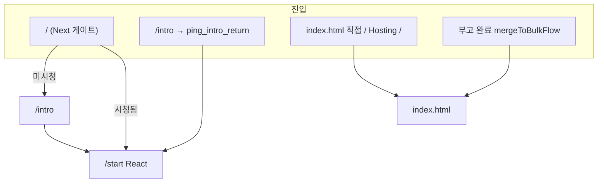
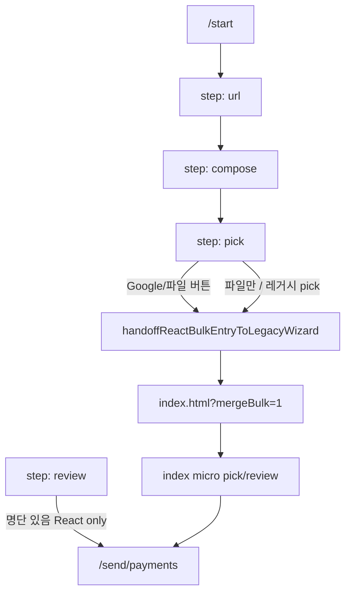

# `index.html` 대량발송 플로 → React 이관 계획

> **2026-06-02 완료.** 런타임 UI는 **`/start`** React 위저드만. 상태: [`html-to-next-migration-status.md`](./html-to-next-migration-status.md)

---

## 완료 판정 (Step 4) — ✅

- [x] 프로덕션 사용자 경로에 `index.html` / `index.html?mergeBulk=1` **필수 진입 없음**
- [x] `handoffReactBulkEntryToLegacyWizard` **제거** · bulk 플로 `/start` 단일 클라이언트
- [x] Firebase Hosting `/` → `index.html` rewrite **제거** (Vercel UI)
- [x] `npm run smoke` — `/start` · `/checkout` · `/payment-success` 등
- [ ] 프로덕션 Vercel env·DNS·토스 live E2E — 배포 담당자 ([`vercel-production-handoff.md`](./vercel-production-handoff.md))

---

## (역사) Step 1–3

아래 mermaid·표는 이관 **전** `index.html` 분석용. 세션 키는 [`index-bulk-flow-reference.md`](./index-bulk-flow-reference.md) 유지.

### 1.1 진입 축 (3갈래)



| 진입 | 조건 | 첫 화면 |
|------|------|---------|
| Next `/` | `!ping_intro_seen` | `/intro` |
| Next `/` | `ping_intro_seen` | `/start` |
| `index.html` | `pingFlowShouldSkipEntry()` false | `#index-flow-step-zero` (레거시 step-zero) |
| `index.html` | `mergeBulk` / `resumeBulk` / `thankyou` / 세션 복원 등 | `#index-flow-after-entry` (본 플로) |
| `mergeToBulkFlow()` | 부고 URL 있음 | `index.html?mergeBulk=1` |

`pingFlowShouldSkipEntry()` 참: `mergeBulk`, `resumeBulk`, `autoPay`, `thankyou`, `bulkAfterUrl`, `ping_bulk_recipients`, `PingFlowState.ROUTE_OBITUARY_THEN_BULK` + obituary URL.

---

### 1.2 레거시 `index.html` 내부 축 (`__indexFlowStep`)

| `__indexFlowStep` | UI 블록 | 의미 |
|-------------------|---------|------|
| **(step-zero)** | `#index-flow-step-zero` | 히어로·「대량 발송 시작」— `pingFlowChooseBulkDirect()` 후 after-entry |
| **1** | `#index-flow-step-addressbook` | 위저드: url → pick → review (`__addrMicroStep`) |
| **2** | `#index-flow-step-applicant` | 본인확인 복귀·`autoPay` 시 주문 처리 (DOM은 hydrate용, 폼 폐기 방향) |

`__addrMicroStep`: `url` | `pick` | `review`

---

### 1.3 표준 대량 발송 시퀀스 (부고·일반)

> **제품 단계 번호(①–⑨)는 [`ping-bulk-send-process.md`](./ping-bulk-send-process.md) 가 단일 기준.** 아래는 레거시·URL 관점 요약.

```mermaid
stateDiagram-v2
  direction LR

  state "index step-zero" as Z
  state "micro url" as U
  state "micro pick" as P
  state "micro review" as R
  state "/send/payments" as PAY
  state "/login" as LOGIN
  state "index autoPay" as AP
  state "/checkout" as CHK
  state "/payment-success" as OK

  [*] --> Z: index only
  Z --> U: pingFlowChooseBulkDirect
  U --> P: CTA url단계 완료
  P --> R: Google/파일 processContactsCount
  R --> PAY: indexBulkAdvanceFromAddressbook review
  PAY --> LOGIN: CTA 본인확인
  LOGIN --> AP: identity_ok + resumeBulk autoPay
  AP --> CHK: processOrderInternal
  CHK --> OK: 토스 승인
```



| 단계 | 트리거 | sessionStorage / URL | 다음 |
|------|--------|----------------------|------|
| step-zero → after-entry | `pingFlowChooseBulkDirect` | `ping_flow_route=bulk_direct`, `ping_flow_started=1` | `__indexFlowStep=1`, micro `url` |
| url → pick | `indexBulkAdvanceFromAddressbook` (micro=url) | `ping_wizard_draft` 등 | micro `pick` |
| pick → review | `processContactsCount` | `ping_bulk_recipients`, `ping_bulk_flags` | micro `review` |
| review → payments | `indexBulkAdvanceFromAddressbook` (micro=review) | 채널 `sms`, `ping_send_channel` | **`/send/payments`** |
| payments → login | `payments-client` CTA | `ping_bulk_identity_ok` 제거 후 | **`/login`** |
| login 완료 | (게스트/회원 플로) | `ping_bulk_identity_ok=1` | — |
| payments (이미 인증) | `identity_ok` | — | **`/?resumeBulk=1&autoPay=1`** |
| index 복귀 | `indexTryResumeBulkFlow` | URL에서 resume/autoPay 제거 | `__indexFlowStep=2` → `processOrderInternal` |
| 결제 페이지 | `pingNavigateToCheckout` | `ping_checkout_session`, `ping_toss_pending` | **`/checkout`** (Next 또는 checkout.html) |
| 완료 | redirect | `ping_pay_success_*` | **`/payment-success`** |

**뒤로가기 예외**

| 키 | 동작 |
|----|------|
| `ping_payments_skip_redirect` | `/send/payments` → 뒤로 시 `indexMaybeHandoffToPaymentsPage` 스킵 |
| `ping_review_skip_redirect` | review redirect 1회 스킵 |

---

### 1.4 React `/start` 경로 (현재)



| `/start` 스텝 | React | handoff 시점 |
|---------------|-------|----------------|
| `url` | ✅ | — |
| `compose` | ✅ | — |
| `pick` | UI만 ✅ | **「구글 연락처」「파일」→ `handoffToLegacy(true/false)`** |
| `review` | ✅ (명단 session 있을 때) | CTA **「다음」→ `/send/payments`** (레거시 review 우회) |

---

## Step 2. Handoff 지점 (현재 vs 목표)

### 2.1 Handoff 함수 (`src/lib/ping-flow-client.ts`)

**`handoffReactBulkEntryToLegacyWizard(url, compose, opts)`**

1. `ping_obituary_public_url`, `ping_flow_route=bulk_direct`, `ping_flow_started=1`
2. `ping_from_index` ← 부고 URL, 제목·본문·템플릿, `bulkFlowKind`
3. **`ping_react_bulk_review_return = '1'`** (레거시가 review 대신 React로 돌려보내기 위함)
4. `location.replace('index.html?mergeBulk=1' [&bulkOpenGoogleContacts=1])`

**`index.html` onload (`mergeBulk=1`)**

- `pingFlowShouldSkipEntry()` → after-entry 표시
- `PingFlowState.getObituaryPublicUrl()` → `#external-obituary-url` hydrate
- compose UI 동기화, bugo import 시도
- `bulkOpenGoogleContacts=1` → `loadGoogleContacts()`
- URL에서 `mergeBulk` 제거 (`history.replaceState`)

**레거시 pick/review 완료 후**

- `processContactsCount` → `indexMaybeHandoffToPaymentsPage()`
- `ping_react_bulk_review_return` 있으면 → **`/start`** + `ping_react_bulk_pending_review=1` (React review)
- 없으면 → **`/send/payments`**

### 2.2 목표 (handoff 제거 후)

| 현재 handoff 이후 | 목표 React 라우트 |
|-------------------|-------------------|
| `index.html` pick (Google OAuth, CSV 파싱) | `/start/pick` 확장 또는 `/start/contacts` |
| `index.html` review (레거시 DOM) | `/start/review` (이미 있음, 단독 유지) |
| `index.html` → `/send/payments` | `/start/review` → `/send/payments` (유지 가능) |
| `index.html?resumeBulk&autoPay` | `/start/checkout-prep` 또는 `/checkout` 직전 React |
| `processOrderInternal` in index | 공통 `src/lib/ping-order.ts` + `/checkout` |

---

## Step 3. 스텝별 교체 순서 (병렬 검증)

원칙: **한 스텝씩** React로 옮기고, feature flag 또는 쿼리(`?reactPick=1`)로 **HTML 경로와 병렬** E2E.

| 순서 | 스텝 | 현재 구현 | React 대상 | 검증 포인트 |
|------|------|-----------|------------|-------------|
| **0** | (문서·계측) | — | handoff 횟수 로그 | mergeBulk 진입 카운트 |
| **1** | **주소록 pick** | `index.html` `loadGoogleContacts`, file input, `processContactsCount` | `/start` pick 완결 (OAuth·CSV·네이버) | `ping_bulk_recipients` 동일 스키마, Google `bulkOpenGoogleContacts` |
| **2** | **review** | `/start/review` + 레거시 `index-wiz-review` | `/start/review` 단일화, `ping_react_bulk_*` 제거 | 금액·건수·`ping_from_index` 일치 |
| **3** | **결제 금액** | `/send/payments` (이미 React) | 유지·`indexBulkAdvance` 중복 제거 | 빈 명단 시 `/` 복귀, 뒤로가기 skip 키 |
| **4** | **본인확인** | `/login` (React) → `resumeBulk` | `/login` 완료 후 **`/start` 또는 `/checkout` 직행** (`index` 경유 제거) | `ping_bulk_identity_ok`, `ping_from_index` hydrate |
| **5** | **결제·토스** | `index` `processOrderInternal` → checkout | `/checkout` + API만 (이미 React) | `ping_checkout_session`, webhook, `payment-success` |
| **6** | **토스 복귀** | URL params + session | `checkout`·`payment-success` (React) | 실패·취소·포인트-only |
| **7** | **답례 thankyou** | `index.html?thankyou=1`, `/start?thankyou=1` | `/start` thankyou 모드 통합 | `bulkFlowKind=thankyou` |
| **8** | **레거시 step-zero** | `index.html` `#index-flow-step-zero` | `/`·`/intro`·`/start`만 사용 | Hosting `/` rewrite 정리 |

### 3.1 스텝 1 상세 (주소록) — 최우선

레거시 의존 코드:

- `loadGoogleContacts`, `gapi` OAuth
- `#index-wiz-pick`, `#file`, `processContactsCount`
- `indexMaybeHandoffToPaymentsPage` 분기

React 이관 시:

- `src/app/start/bulk-entry-client.tsx`의 `handoffToLegacy` **제거**
- `ping-flow-client.ts`의 `PING_REACT_BULK_REVIEW_RETURN_KEY` 설정 **제거**
- pick 스텝에서 `ping_bulk_recipients` / `ping_bulk_flags` 기록 후 `setStep('review')` 또는 `/send/payments`

### 3.2 병렬 운영 패턴 (권장)

```text
?bulkEngine=legacy  → 기존 handoff + index.html
?bulkEngine=react   → /start 전 구간 (기본값 전환은 스텝 완료 후)
```

또는 sessionStorage `ping_bulk_engine_v1`.

---

## Step 4. 마일스톤 · 산출물

| 마일스톤 | 산출 | Handoff |
|----------|------|---------|
| M1 | 주소록 React | pick만 `/start`, mergeBulk handoff 유지 → **제거** |
| M2 | review·payments 경로 단일화 | `ping_react_bulk_*` 삭제 |
| M3 | login 복귀 `index` 제거 | `resumeBulk` → `/checkout` prep |
| M4 | `index.html` 대량 플로 미사용 | redirect `index.html` → `/start` |
| M5 | `legacy-html/index.html` 축소·제거 | materialize에서 제외 |

---

## 부록: 공유 sessionStorage (교체 시 깨지면 안 됨)

| 키 | 플로 단계 |
|----|-----------|
| `ping_bulk_recipients` | pick → review → payments → login → checkout |
| `ping_bulk_flags` | Google/CSV/답례 |
| `ping_from_index` | URL·문자·견적 메타 |
| `ping_bulk_identity_ok` | login 완료 |
| `ping_checkout_session` / `ping_toss_pending` | checkout |
| `ping_pay_success_*` | payment-success |
| `ping_flow_route` / `ping_flow_started` | 전역 플로 |
| `ping_compose_image_data` | compose 첨부 |

---

## 관련 파일

| 파일 | 역할 |
|------|------|
| `legacy-html/index.html` | 레거시 단일 페이지 (진실 원천, ~8.6k lines) |
| `src/app/start/bulk-entry-client.tsx` | React step-zero |
| `src/lib/ping-flow-client.ts` | handoff · mergeToBulkFlow |
| `src/app/send/payments/payments-client.tsx` | 결제 금액 확인 |
| `src/app/login/` | 본인확인 |
| `src/app/checkout/` | 토스 결제 |
| `assets/js/ping-flow-state.js` | 레거시 PingFlowState |
