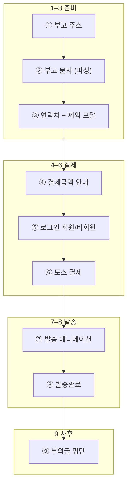

# PING 대량 발송 — 공식 프로세스 (9단계)

> **단일 기준 문서.** UI·이관·QA는 이 순서를 따른다.  
> 구현이 아직 레거시인 구간은 **「현재」** 열에 표기한다.

---

## 1. 단계 정의 (제품 규칙)

| # | 단계 | 사용자가 하는 일 | 완료 조건 |
|---|------|-----------------|-----------|
| **1** | **부고 주소** | 부고 페이지 `https://` URL 입력·붙여넣기 | 유효 URL 확정 (`ping_from_index.obituaryPageUrl`) |
| **2** | **부고 문자메세지 (파싱)** | 스크래핑 본문 확인·제목·본문·템플릿·(선택) 이미지 편집 | 본문 바이트·제목 규칙 통과, 초안 세션 저장 |
| **3** | **연락처** | Google 연락처 / 네이버·CSV 파일 업로드 → **발송 제외 명단 모달**에서 제외 선택 | `ping_bulk_recipients` ≥ 1, 플래그(`isGoogleContactsMode` 등) 저장 |
| **4** | **결제금액 안내** | 수신 건수·단가·총액·채널 확인 | 사용자가 금액 안내 화면 확인 후 다음 동의 |
| **5** | **로그인** | **회원** 로그인 또는 **비회원(게스트)** 본인확인 | `ping_bulk_identity_ok = 1` |
| **6** | **결제하기** | 토스페이먼츠 결제 UI | 결제 승인·주문 ID 확보 |
| **7** | **발송 과정 애니메이션** | 발송·API 처리 중 로딩 UI | 서버 발송 트리거 완료(실패 시 재시도/안내) |
| **8** | **발송완료** | 완료 메시지·요약 | `ping_pay_success_*` 등 성공 세션 |
| **9** | **부의금 명단 작성** | 발송 명단 기반 부의금 정리·엑셀/일괄 입력 | `/mypage/condolence` 또는 완료 화면 다운로드 |

**인트로·홈** (`/intro`, `/`) 은 위 1단계 **이전** 진입 게이트이며, 9단계에 포함하지 않는다.

**답례 문자 플로** (`thankyou=1`, `bulkFlowKind: thankyou`) 는 **1·2단계 생략**(부고 URL·부고 파싱 없음), **3단계부터** 동일 규칙(문자 초안은 답례 템플릿).

---

## 2. 전체 흐름도

---

## 3. 라우트·화면 매핑 (현재 구현)

| # | 단계 | 권장 URL / 화면 | 주요 코드·DOM |
|---|------|-----------------|---------------|
| 1 | 부고 주소 | `/start` `step=url` | `bulk-entry-client.tsx` |
| 2 | 부고 문자 (파싱) | `/start` `step=compose` | `ping-bugo-import.ts`, `tryBugoImportForUrl` |
| 3 | 연락처 | `/start` `step=pick` (Google/CSV + 제외 모달) | `bulk-entry-client.tsx`, `fetchGoogleContactPickerRows`, `saveBulkRecipientsToSession` |
| 4 | 결제금액 안내 | `/start` `step=review` **또는** `/send/payments` | `computeBulkOrderTotals`, `send/payments` |
| 5 | 로그인 | `/login` (회원·게스트) | `login/[[...slug]]`, `obituary-entry` 리다이렉트 |
| 6 | 결제하기 | `/checkout` | PortOne·토스, `ping_checkout_session` |
| 7 | 발송 애니메이션 | `/payment-success` (진입 직후) **또는** 레거시 주문 처리 오버레이 | `payment-success-client.tsx`, `processOrderInternal` |
| 8 | 발송완료 | `/payment-success` | `payment-success-client.tsx` |
| 9 | 부의금 명단 | `/mypage/condolence` · 완료 화면 엑셀 | `condolence-client.tsx`, payment-success 엑셀 CTA |

---

## 4. 단계별 전환 규칙

### ① 부고 주소 → ② 부고 문자

| 규칙 | 내용 |
|------|------|
| 진입 | `/start`, `step=url` (답례 플로 제외) |
| CTA | **없음** — 유효 URL 시 **자동** `compose` ([`bulk-start-page-transitions.md`](./bulk-start-page-transitions.md)) |
| 파싱 | 우리부고·모두부고 URL → API import 후 `ping_from_index`에 본문·제목 반영 |
| 그 외 URL | URL만 저장, compose에서 기본 템플릿 |

### ② 부고 문자 → ③ 연락처

| 규칙 | 내용 |
|------|------|
| CTA | compose 하단 **「다음」** |
| 검증 | `isBulkSmsBodyStepValid`, 제목 길이 |
| 저장 | `ping_from_index` · `ping_compose_image_data` |

### ③ 연락처

| 수단 | 동작 |
|------|------|
| Google | OAuth → 명단 로드 → **제외 모달** → 확정 |
| 네이버 / CSV | 파일 선택 → 파싱 → **제외 모달** → 확정 |
| 제외 모달 | `#recipient-exclude-modal` — 체크한 연락처는 **발송 대상에서 제외** |

| 규칙 | 내용 |
|------|------|
| React | `pick` 에서 Google/파일 → **레거시 핸드오프** (pick·모달·집계는 `index.html`) |
| 완료 | `ping_bulk_recipients` 배열 확정, `processContactsCount` |

### ③ → ④ 결제금액 안내

| 규칙 | 내용 |
|------|------|
| React | 명단 확정 후 `review` 또는 CTA → `/send/payments` |
| 레거시 | micro `review` → `indexMaybeHandoffToPaymentsPage` → `/send/payments` |
| 표시 | 수신 건수, 기본료·건당, 총액, 채널(문자 LMS 등) |

### ④ → ⑤ 로그인

| 규칙 | 내용 |
|------|------|
| 트리거 | `/send/payments` 에서 본인확인·결제 진행 CTA |
| 미인증 | `ping_bulk_identity_ok` 없으면 **`/login`** |
| 회원 | 기존 계정 로그인 |
| 비회원 | 게스트 본인확인 플로 (`/login` slug) |

### ⑤ → ⑥ 결제하기

| 규칙 | 내용 |
|------|------|
| 인증 후 | `/?resumeBulk=1&autoPay=1` 또는 `/checkout` 직행 |
| 결제 | 토스페이먼츠 · `ping_toss_pending`, `ping_checkout_session` |
| 화면 | `/checkout` (Next) |

### ⑥ → ⑦⑧ 발송

| 규칙 | 내용 |
|------|------|
| 승인 후 | `/payment-success` 리다이렉트 |
| ⑦ | 발송 처리 중 **애니메이션/로딩** (완료 화면 내 단계 또는 레거시 오버레이) |
| ⑧ | 성공 UI, 주문·건수 요약 |

### ⑧ → ⑨ 부의금 명단

| 규칙 | 내용 |
|------|------|
| 즉시 | payment-success 에서 **발송 명단 엑셀** 다운로드 |
| 지속 | `/mypage/condolence?bugoRequestId=` — 부의금 입력·일괄 업로드 |
| 데이터 | Prisma `condolenceMoney`, `/api/condolence` |

---

## 5. `/start` 위저드와 9단계 관계

React `/start` 는 **①②③의 앞부분 + ④의 일부(review)** 만 담당한다.

| 9단계 | `/start` 내부 |
|-------|----------------|
| ① | `url` |
| ② | `compose` |
| ③ | `pick` (UI) → 핸드오프 후 실질 처리는 `index.html` |
| ④ | `review` → `/send/payments` |
| ⑤–⑨ | `/start` **밖** |

스텝 인디케이터(예: `1단계 / 4`)는 **①–④ 준비 구간**만 표시한다. 전체 9단계 번호와 혼동하지 않는다.

---

## 6. 세션·URL 키 (단계 간 계약)

| 키 / 파라미터 | 관련 단계 |
|---------------|-----------|
| `ping_from_index` | ①② |
| `ping_bulk_recipients`, `ping_bulk_flags` | ③④ |
| `ping_bulk_identity_ok` | ⑤ |
| `ping_checkout_session`, `ping_toss_pending` | ⑥ |
| `ping_pay_success_*` | ⑦⑧ |
| `resumeBulk`, `autoPay`, `mergeBulk` | ④⑤⑥ 복귀 |
| `bugoRequestId` (condolence) | ⑨ |

상세 표: [`index-bulk-flow-reference.md`](./index-bulk-flow-reference.md) §3.

---

## 7. 이관·QA 체크리스트

- [ ] ① URL 자동 전환·파싱 실패 시 ①에 머무름  
- [ ] ③ Google / 네이버·CSV / 제외 모달 E2E  
- [ ] ④ 금액 = 번호 있는 행만 집계  
- [ ] ⑤ 회원·비회원 모두 `identity_ok`  
- [ ] ⑥ 토스 sandbox/production 콘솔 URL  
- [ ] ⑦⑧ 애니메이션 후 완료 문구·실패 안내  
- [ ] ⑨ 엑셀·mypage condolence 동일 명단 기준  

이관 순서: [`index-html-react-migration-plan.md`](./index-html-react-migration-plan.md) — **③ pick·모달 → ④ review → ⑤ login 연결** 을 React에 흡수할 때도 **이 9단계 번호는 유지**한다.

---

## 8. 관련 문서

| 문서 | 용도 |
|------|------|
| [`bulk-start-page-transitions.md`](./bulk-start-page-transitions.md) | `/start` ①② CTA·자동 전환 |
| [`index-bulk-flow-reference.md`](./index-bulk-flow-reference.md) | 레거시 DOM·함수·세션 |
| [`index-html-react-migration-plan.md`](./index-html-react-migration-plan.md) | React 이관 로드맵 |
